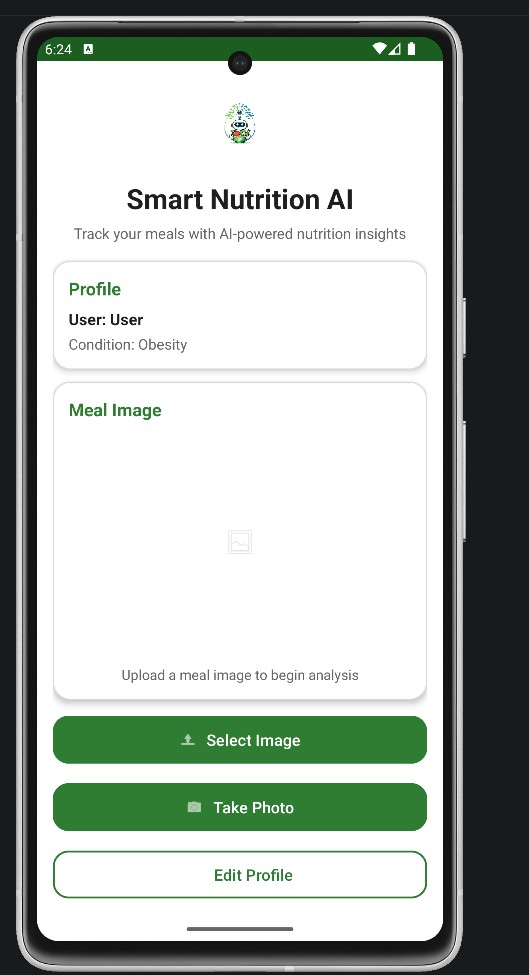
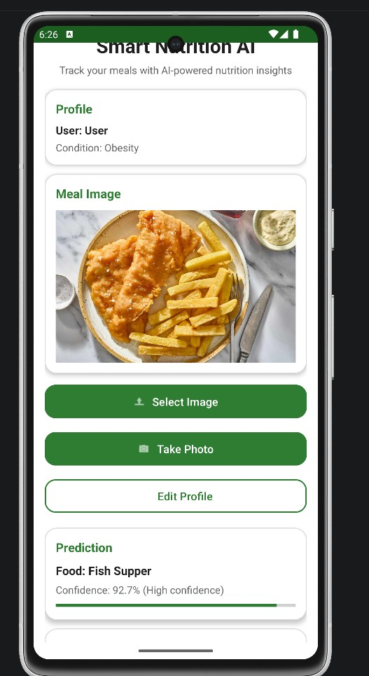
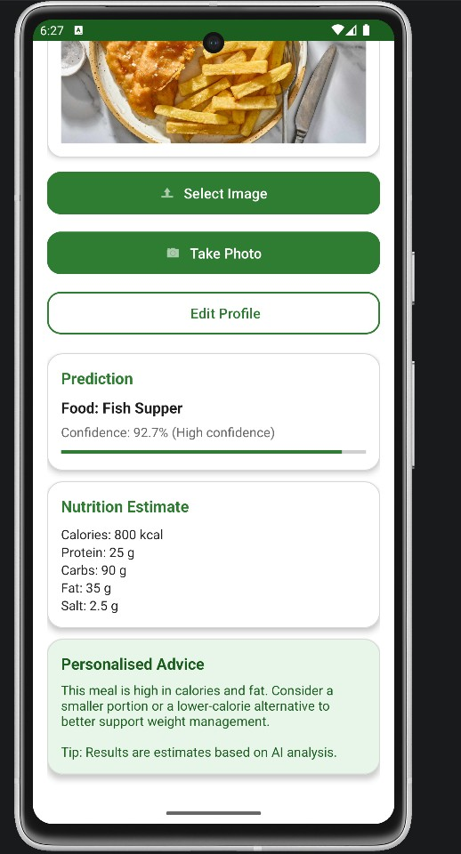

# NutriVision AI

AI-powered Android dietary monitoring application using TensorFlow Lite for real-time food classification and personalised nutritional analysis.

---

## Overview

NutriVision AI is a mobile AI application designed to assist users with dietary monitoring through computer vision and deep learning technologies. The application performs real-time food classification directly on Android devices using TensorFlow Lite and provides personalised health recommendations based on nutritional analysis.

The project was developed as part of an Honours Computing research project focusing on AI-assisted dietary monitoring for chronic disease management.

---

## Features

- Real-time food recognition
- TensorFlow Lite on-device inference
- Android camera integration
- Nutritional analysis
- Personalised dietary recommendations
- Health condition-based advice
- Privacy-aware local processing
- Real-device deployment
- Lightweight mobile AI architecture
- Custom trained food classification model

---

## Screenshots

### Home Screen


### Food Classification Result


### Personalised Health Advice


---

## Technologies Used

### Artificial Intelligence & Machine Learning
- TensorFlow
- TensorFlow Lite
- Convolutional Neural Networks (CNN)
- Transfer Learning
- Image Classification

### Mobile Development
- Kotlin
- Android Studio
- XML

### Data Processing
- Python
- NumPy
- Pandas
- Google Colab

### Development Tools
- Git
- GitHub

---

## Model Performance

- Achieved 91.78% test accuracy
- Custom dataset containing 1000+ food images
- Balanced food classification dataset
- Optimised for real-time mobile inference
- Successfully deployed on Android devices

---

## System Workflow

1. User captures or selects a food image
2. Image preprocessing pipeline prepares the image
3. CNN model performs food classification
4. TensorFlow Lite executes inference on-device
5. Nutritional analysis is generated
6. Personalised dietary advice is displayed to the user

---

## Dataset

The custom dataset used for training included Scottish food categories such as:

- Fish Supper
- Scotch Pie
- Haggis
- Porridge
- Scottish Breakfast

The dataset was manually curated and balanced to improve classification performance and reduce overfitting.

---

## Future Improvements

- AR-based portion estimation
- Cloud analytics dashboard
- User authentication system
- Meal history tracking
- Federated learning integration
- Real-time cloud synchronisation
- Expanded food dataset support
- Advanced nutritional analytics

---

## Installation

### Clone Repository

```bash
git clone https://github.com/DaudBytes/nutrivision-ai.git
```

### Open in Android Studio

1. Open Android Studio
2. Select "Open Existing Project"
3. Navigate to the cloned repository
4. Allow Gradle sync to complete
5. Run the application on an Android device or emulator

---

## Project Structure

```text
app/
 ├── src/
 │    ├── main/
 │    │    ├── java/
 │    │    ├── res/
 │    │    ├── assets/
 │    │    └── AndroidManifest.xml
 ├── screenshots/
 ├── README.md
```

---

## Research Focus

This project explores the use of:
- Mobile artificial intelligence
- Edge AI inference
- Privacy-aware healthcare systems
- Dietary monitoring technologies
- AI-assisted chronic disease support

---

## Author

### Daud Ahmad

Graduate Software Engineer | AI & Data Analytics

- GitHub: https://github.com/DaudBytes
- LinkedIn: https://www.linkedin.com/in/daud-ahmad-734513198/

---